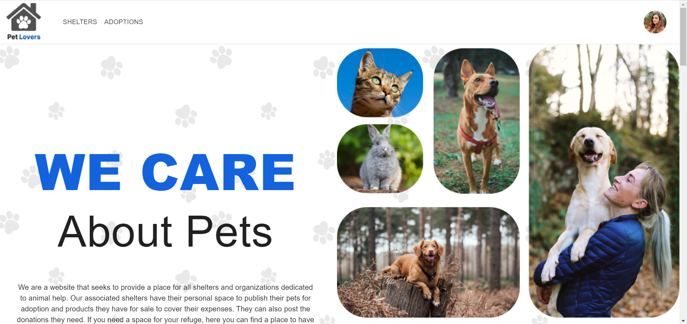
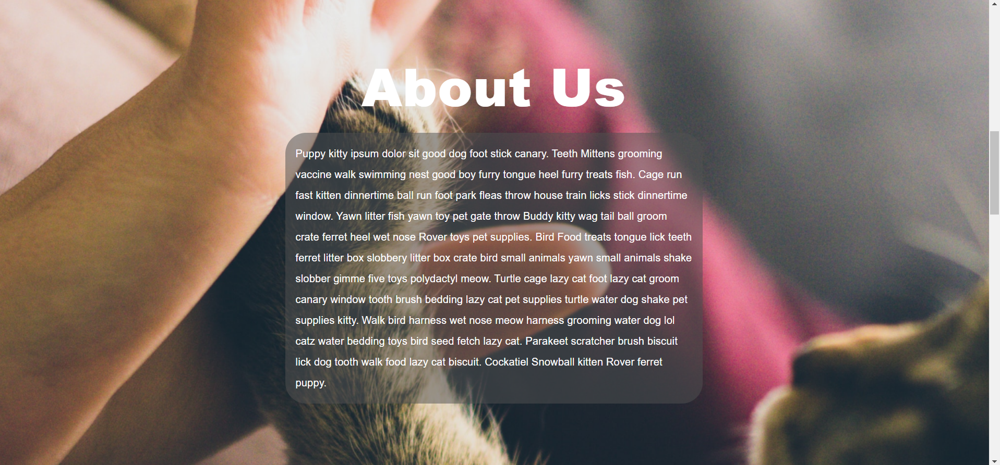
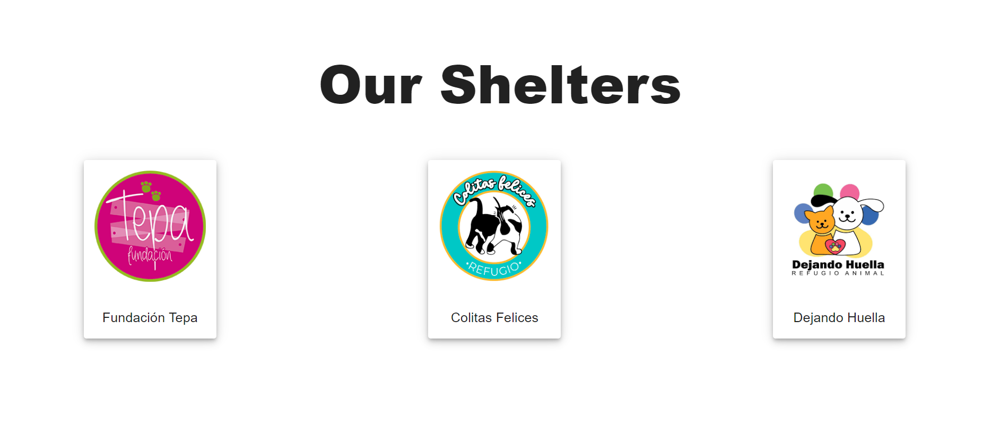
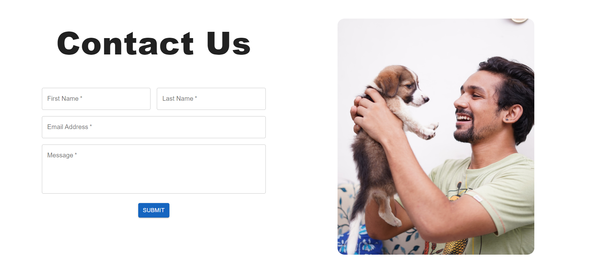
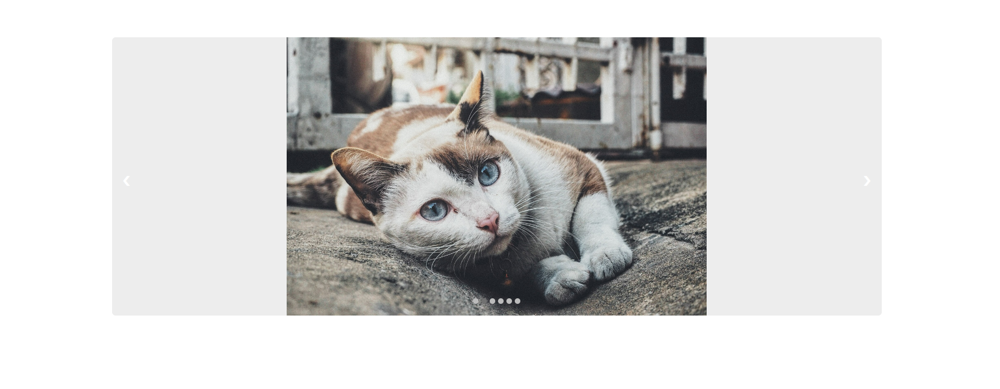
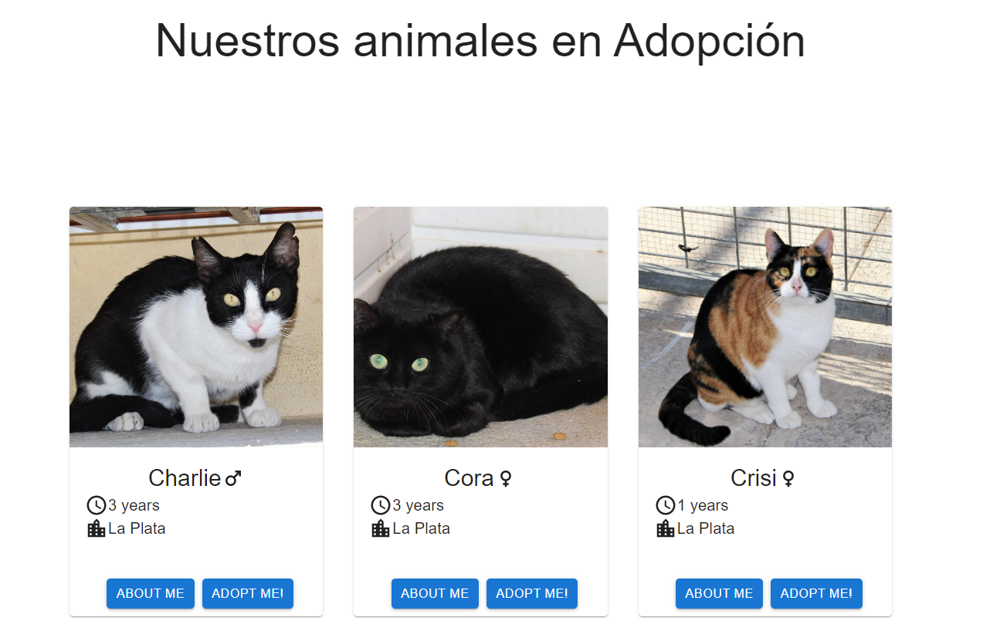
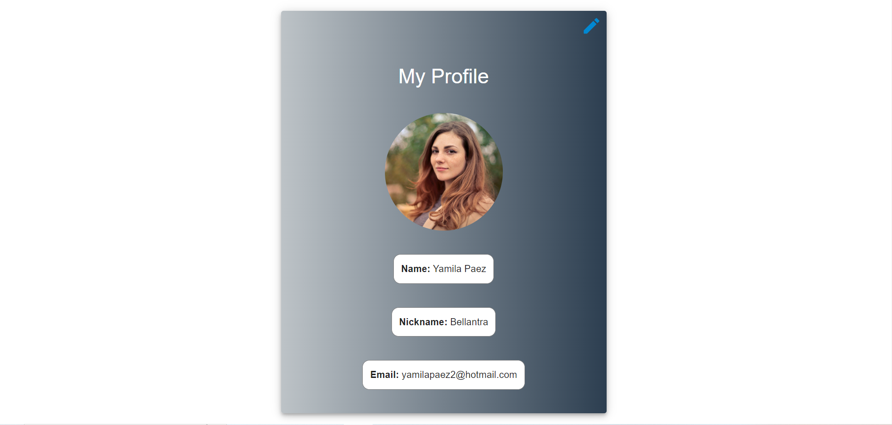
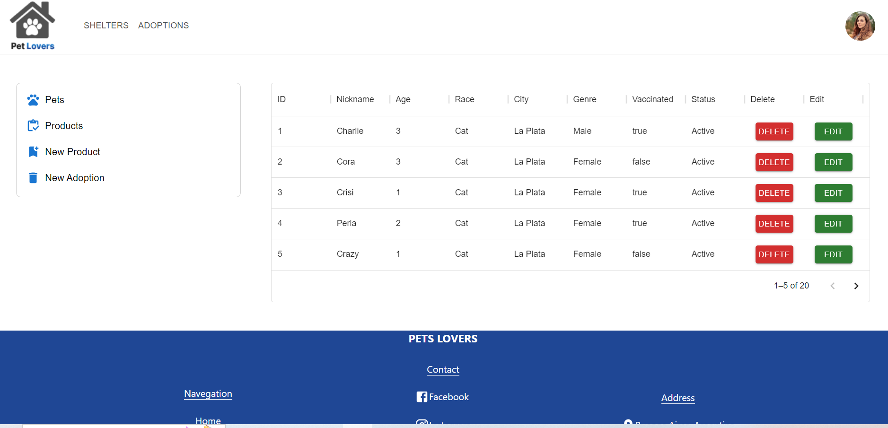
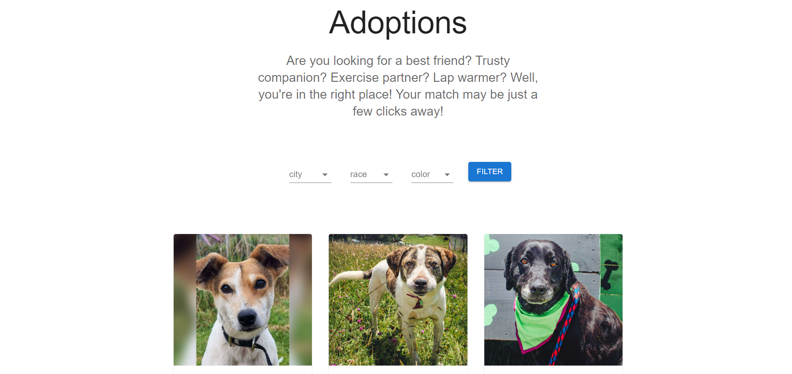

https://github.com/Bellantra/PetLovers-App

## We are a website that seeks to provide a place for all shelters and organizations dedicated to animal help. Our associated shelters have their personal space to publish their pets for adoption and products they have for sale to cover their expenses. They can also post the donations they need. If you need a space for your refuge, here you can find a place to have it. People can find rescued animals for adoption in good health, waiting for that dream family.


### Built with 🛠️

           
 

#

### Requirements 📋

_1 - You will have to create a .env in client and api folders_

_2 - You will have to create you own database in [Mongo](https://www.mongodb.com/cloud/atlas/lp/try2?utm_source=google&utm_campaign=gs_emea_france_search_core_brand_atlas_desktop&utm_term=mongo&utm_medium=cpc_paid_search&utm_ad=e&utm_ad_campaign_id=12212624521&adgroup=115749705063&gclid=CjwKCAjwqauVBhBGEiwAXOepkQjTRQPRmN-nR-TQye1UfooktuEkqnQ8TKT7mPD5p33PRWbZcOgSzxoCBOMQAvD_BwE) website_

_3 - You will have to create you own account for [emailjs](https://www.emailjs.com/)_

_4 - You will have to create you own account for [cloudinary](https://cloudinary.com/)

_Api .env_

```
DB_URL= url MongoDB
PORT= Number of the port where you wanna run api (ex. 4001)
```

_Client .env_

```

VITE_APP_SERVIDE_ID = For use email Js Contact
VITE_APP_TEMPLATE_ID = For use email Js Contact
VITE_APP_PUBLIC_KEY = For use email Js Contact

VITE_APP_PRESET_USER = preset to upload user photos in cloudinary
VITE_APP_PRESET_PRODUCTS = preset to upload products photos in cloudinary
VITE_APP_PRESET_ADOPT_PETS= preset to upload pets photos in cloudinary

VITE_APP_CLOUDNAME = name of your cloudinary

VITE_APP_API_ROUTE = localhost of you api ( ex. http://localhost:4001)
```

#

### You can check out our webpage in the following link: [click here](https://pet-lovers-henna.vercel.app/)

#

### Developers 🚀

### Yamila Paez : [LinkedIn](https://www.linkedin.com/in/yamila-paez-70b7587b/) [GitHub](https://github.com/Bellantra)

### Gabriel Garcia : [LinkedIn](https://www.linkedin.com/in/gabrielgarcia-full-stack-developer/) [GitHub](https://github.com/gabriel20x)

### Cesar Galeano : [LinkedIn](https://www.linkedin.com/in/cesargaleanotorres/) [GitHub](https://github.com/cesargaleano)

#

### Some Pictures










